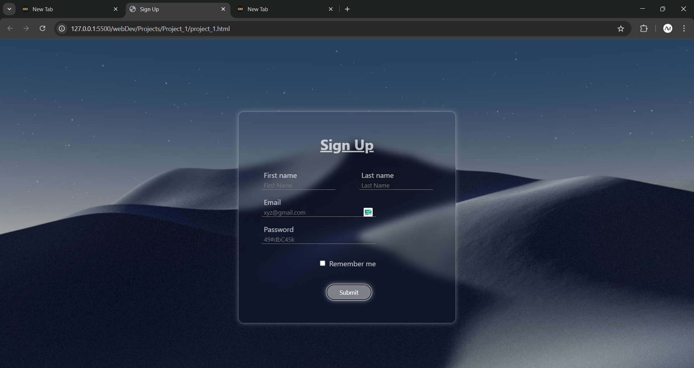

# Project 01 – Glassmorphism Sign-Up Form

This is my **first self-built project** while learning web development.  
It’s a sign-up form with a glassmorphic container, smooth hover animations, and gradient effects.  
The background image is inspired by a night desert theme. (the image is not mine, but open-sourced)

## Preview

## Built With
- **HTML5**
- **CSS3** (grid layout, transitions, animations, backdrop-filter)

## Features
- Glassmorphism effect with `backdrop-filter`
- Animated gradient shadow on hover
- Smooth hover effects for inputs and button
- Minimal, clean design inspired by the background image

## Known Limitations
- **Not responsive** – the layout may break on smaller screens
- Background image is fixed size (not using `background-size: cover` for all cases yet)
- No JavaScript – features like "show password" are not implemented
- The form does not submit data (purely front-end)

## What I Learned
- How to use `backdrop-filter` for a glass effect
- CSS keyframe animations for shadows
- How to structure a simple HTML form with `grid` layout
